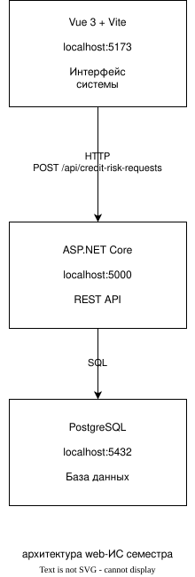

# Архитектура информационной системы

## Архитектура web-ИС

Информационная система автоматизации анализа кредитных рисков в подсистеме управления кредитным портфелем АО «ТБанк» построена по трёхуровневой архитектуре.

Система состоит из трёх основных компонентов:

1. Vue 3 + Vite — клиентская часть системы, которая отвечает за интерфейс пользователя.
2. ASP.NET Core — серверная часть, которая принимает HTTP-запросы, выполняет бизнес-логику и взаимодействует с базой данных.
3. PostgreSQL — база данных, в которой хранятся заявки на анализ кредитных рисков, пользователи и виды кредитных рисков.

Vue 3 работает на порту 5173, ASP.NET Core — на порту 5000, PostgreSQL — на порту 5432.

Браузер не подключается к PostgreSQL напрямую. Все запросы к данным проходят через API ASP.NET Core.

**архитектура web-ИС семестра**
